## Contact Fix

This app fixes the contacts in your phone by adding the country code and
the area code when needed. It also format the the phone numbers adding
spaces and removing unwanted characters.

Assume that the default country code is `+1` and the area code is `314`.

The phone number `4880506` would become `+1 314 488 0506`.

This is useful because when you leave your area or country you will need
this codes to complete the call. Also it will be easier to read.

You can download this app on Google Play
[here](https://play.google.com/store/apps/details?id=com.gmail.vpjardimdev.contatctsfix).

### Current Supported Countries

| Country Name  | ISO Code | Country Code | Flag |
|:-------------:|:--------:|:------------:|:----:|
| American Samoa                   | AS | +1 |  |
| Anguilla                         | AI | +1 |  |
| Antigua and Barbuda              | AG | +1 | 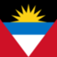 |
| Bahamas                          | BS | +1 | 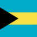 |
| Barbados                         | BB | +1 | 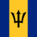 |
| Bermuda                          | BM | +1 |  |
| Brazil                           | BR | +55 | 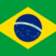 |
| British Virgin Islands           | VG | +1 |  |
| Canada                           | CA | +1 |  |
| Cayman Islands                   | KY | +1 |  |
| Dominica                         | DM | +1 | 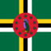 |
| Dominican Republic               | DO | +1 | 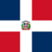 |
| Grenada                          | GD | +1 | 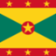 |
| Guam                             | GU | +1 |  |
| Jamaica                          | JM | +1 | 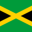 |
| Montserrat                       | MS | +1 |  |
| Northern Mariana Islands         | MP | +1 |  |
| Puerto Rico                      | PR | +1 |  |
| Saint Kitts and Nevis            | KN | +1 | 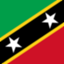 |
| Saint Lucia                      | LC | +1 | 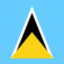 |
| Saint Vincent and the Grenadines | VC | +1 |  |
| Sint Maarten                     | SX | +1 |  |
| Trinidad and Tobago              | TT | +1 |  |
| Turks and Caicos Islands         | TC | +1 |  |
| United States                    | US | +1 | 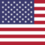 |
| United States Virgin Islands     | VI | +1 |  |

### License
Contact Fix is licensed under the
[Apache 2 License](http://www.apache.org/licenses/LICENSE-2.0.html),
meaning you can use it free of charge, without strings attached in
commercial and non-commercial projects. I would like to get
(non-mandatory) credit in case you use this code in your project.